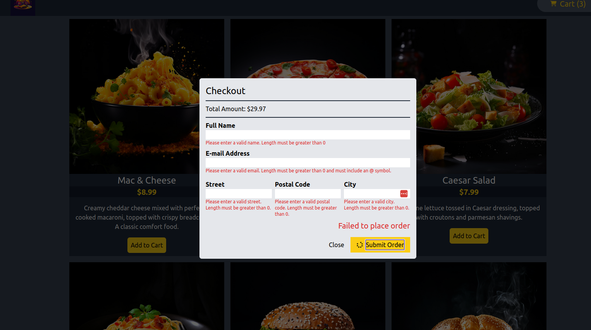

### App startup
`npm run dev` -> to start the frontend

`cd backend && npm start` to start the backend.
The backend is made by maximillian schwarzmueller.

### Tools used:
react, tailwindcss, html, javascript

### App description
You can add a meal to your cart and then place an order!

Context is used to keep track of state, tailwind is used for the styling of the app.

Modals are used, including a portal to make the website more accessible.

There is also validation and some animations (spinner) to improve UX.

### Images

